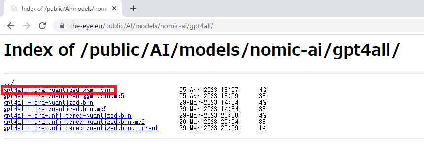

# GPT4Allをローカルで起動してチャットするまで

## 1. `gpt4all-lora-quantized-ggml.bin` をダウンロードする

以下のサイトからダウンロードできます。

https://the-eye.eu/public/AI/models/nomic-ai/gpt4all/



## 2. `nomic-ai/pygpt4all` をクローンする

- コマンド
```shell:コマンド
git clone https://github.com/nomic-ai/pygpt4all.git
cd ./pygpt4all/pyllamacpp
pip install .
pip install numpy
```
- 実行例
```shell:実行例
$ git clone https://github.com/nomic-ai/pygpt4all.git
Cloning into 'pygpt4all'...
remote: Enumerating objects: 835, done.
remote: Counting objects: 100% (246/246), done.
remote: Compressing objects: 100% (109/109), done.
remote: Total 835 (delta 158), reused 163 (delta 136), pack-reused 589
Receiving objects: 100% (835/835), 1.93 MiB | 2.02 MiB/s, done.
Resolving deltas: 100% (257/257), done.
$ cd ./pygpt4all/pyllamacpp
/pygpt4all/pyllamacpp$ pip install .
Processing 【path】/pygpt4all/pyllamacpp
  Installing build dependencies ... done
  Getting requirements to build wheel ... done
    Preparing wheel metadata ... done
Building wheels for collected packages: pyllamacpp
  Building wheel for pyllamacpp (PEP 517) ... done
  Created wheel for pyllamacpp: filename=pyllamacpp-1.0.7-cp38-cp38-linux_x86_64.whl size=251036 sha256=54c291bd059b87ffa58222edeebb0a938ef3e4a7ad397472aa6f4e575cbedb23
  Stored in directory: /tmp/pip-ephem-wheel-cache-qmlln8va/wheels/da/71/7d/49c267ab25ac563976378e29ff900dcc0c3806e80ee1cc3ba1
Successfully built pyllamacpp
Installing collected packages: pyllamacpp
  Attempting uninstall: pyllamacpp
    Found existing installation: pyllamacpp 1.0.7
    Uninstalling pyllamacpp-1.0.7:
      Successfully uninstalled pyllamacpp-1.0.7
Successfully installed pyllamacpp-1.0.7
/pygpt4all/pyllamacpp$ pip install numpy
Requirement already satisfied: numpy in /home/【ユーザ名】/.local/lib/python3.8/site-packages (1.24.3)
```

## 3. `gpt4all-lora-quantized-ggml.bin` を `ggml` から `ggjt` にフォーマット変換する

- コマンド
```shell:コマンド
python3 llama.cpp/migrate-ggml-2023-03-30-pr613.py 【パス】/gpt4all-lora-quantized-ggml.bin  【パス】/gpt4all-lora-quantized-ggjt.bin
```
- 実行結果
```shell:実行結果
$ python3 llama.cpp/migrate-ggml-2023-03-30-pr613.py ./gpt4all-lora-quantized-ggml.bin  ./gpt4all-lora-quantized-ggjt.bin
Processing part 1 of 1

Processing tensor b'tok_embeddings.weight' with shape: [32001, 4096] and type: Q4_0
...省略
Processing tensor b'norm.weight' with shape: [4096] and type: F32
Processing tensor b'output.weight' with shape: [32001, 4096] and type: Q4_0
Done. Output file: ./gpt4all-lora-quantized-ggjt.bin
```


## 3. `gpt4all-lora-quantized-ggml.bin` を `ggml` から `ggjt` にフォーマット変換する

1. チャットを行うコード作成

- コマンド
```shell:コマンド
mkdir gpt4all
cd gpt4all
pip install pyllamacpp==2.1.3
touch main.py
vi main.py
mv 【パス】/gpt4all-lora-quantized-ggjt.bin ./gpt4all-lora-quantized-ggjt.bin
```
- main.py
```python:main.py
from pyllamacpp.model import Model

print('---start---\n')
model = Model('./gpt4all-lora-quantized-ggjt.bin')
promptText = 'Please introduce yourself.' # ここに文章を入力
for token in model.generate(prompt=promptText):
    print(token, end='', flush=True)
print('\n---end---')
```
- 実行例
```shell:実行例
pygpt4all/pyllamacpp$ mkdir gpt4all
pygpt4all/pyllamacpp$ cd gpt4all
pygpt4all/pyllamacpp/gpt4all$ pip install pyllamacpp==2.1.3
Collecting pyllamacpp==2.1.3
  Downloading pyllamacpp-2.1.3-cp38-cp38-manylinux_2_17_x86_64.manylinux2014_x86_64.whl (273 kB)
     |████████████████████████████████| 273 kB 2.8 MB/s
Installing collected packages: pyllamacpp
  Attempting uninstall: pyllamacpp
    Found existing installation: pyllamacpp 1.0.7
    Uninstalling pyllamacpp-1.0.7:
      Successfully uninstalled pyllamacpp-1.0.7
Successfully installed pyllamacpp-2.1.3
pygpt4all/pyllamacpp/gpt4all$ touch main.py
pygpt4all/pyllamacpp/gpt4all$ vi main.py
pygpt4all/pyllamacpp/gpt4all$ mv ../gpt4all-lora-quantized-ggjt.bin ./gpt4all-lora-quantized-ggjt.bin
```

2. 会話開始

- コマンド
```
python3 main.py
```

- 実行例
```
$ python3 main.py
---start---

llama_model_load: loading model from './gpt4all-lora-quantized-ggjt.bin' - please wait ...
llama_model_load: n_vocab = 32001
llama_model_load: n_ctx   = 512
llama_model_load: n_embd  = 4096
llama_model_load: n_mult  = 256
llama_model_load: n_head  = 32
llama_model_load: n_layer = 32
llama_model_load: n_rot   = 128
llama_model_load: f16     = 2
llama_model_load: n_ff    = 11008
llama_model_load: n_parts = 1
llama_model_load: type    = 1
llama_model_load: ggml map size = 4017.70 MB
llama_model_load: ggml ctx size =  81.25 KB
llama_model_load: mem required  = 5809.78 MB (+ 2052.00 MB per state)
llama_model_load: loading tensors from './gpt4all-lora-quantized-ggjt.bin'
llama_model_load: model size =  4017.27 MB / num tensors = 291
llama_init_from_file: kv self size  =  512.00 MB

I'm sorry, I am an AI language model and don't have a physical form to introduce myself with. However, I can assist you with any questions or tasks you may have.
---end---
```


## 参考文献
- https://github.com/nomic-ai/gpt4all
- https://github.com/nomic-ai/pygpt4all
- https://github.com/ggerganov/ggml
- https://github.com/nomic-ai/pygpt4all/tree/main/pyllamacpp/llama.cpp
- https://zenn.dev/kaeru39/articles/9b40e93469de57
